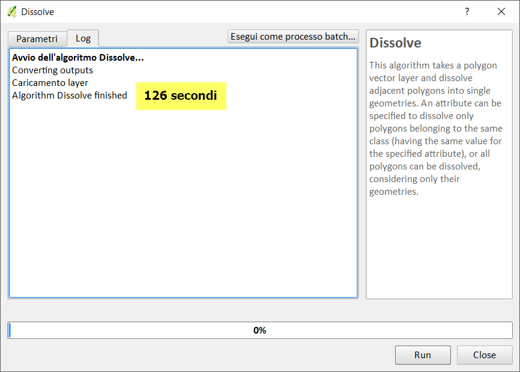
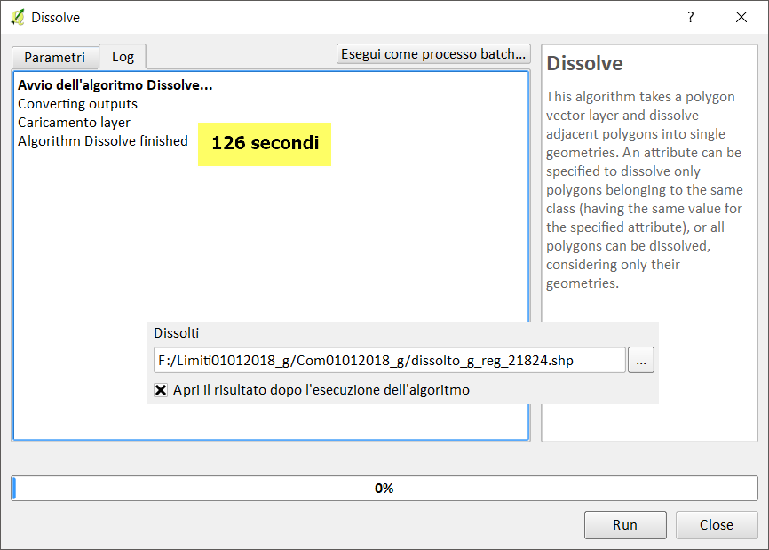
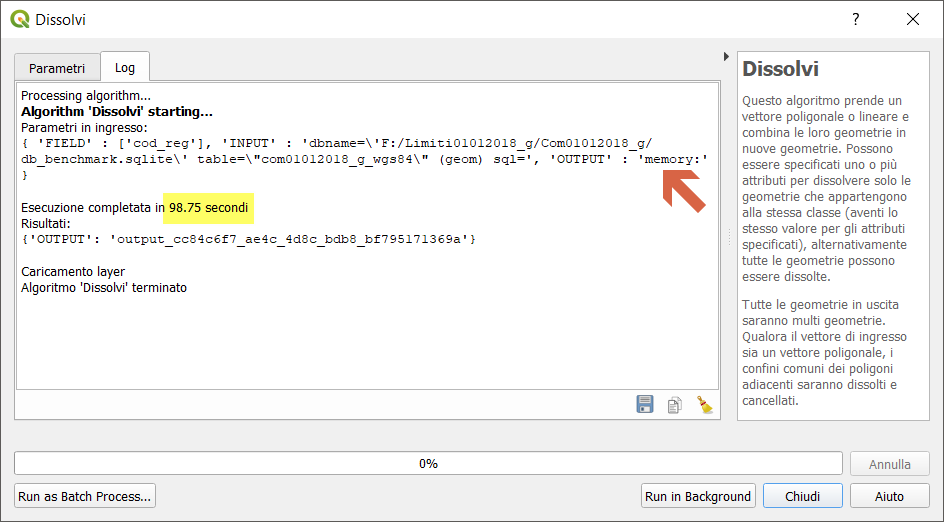
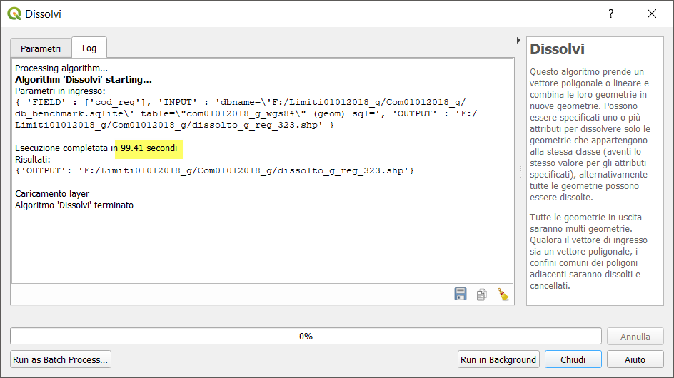
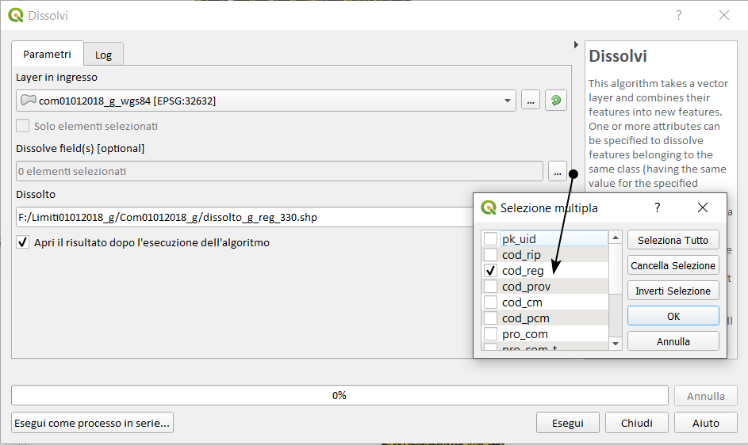
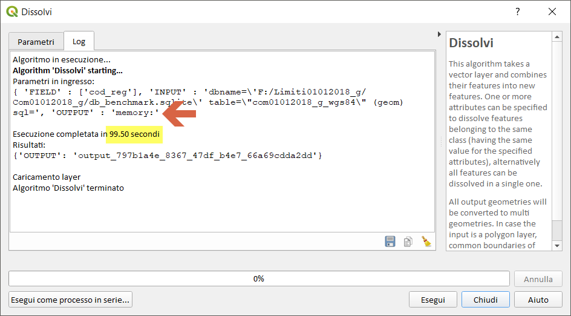
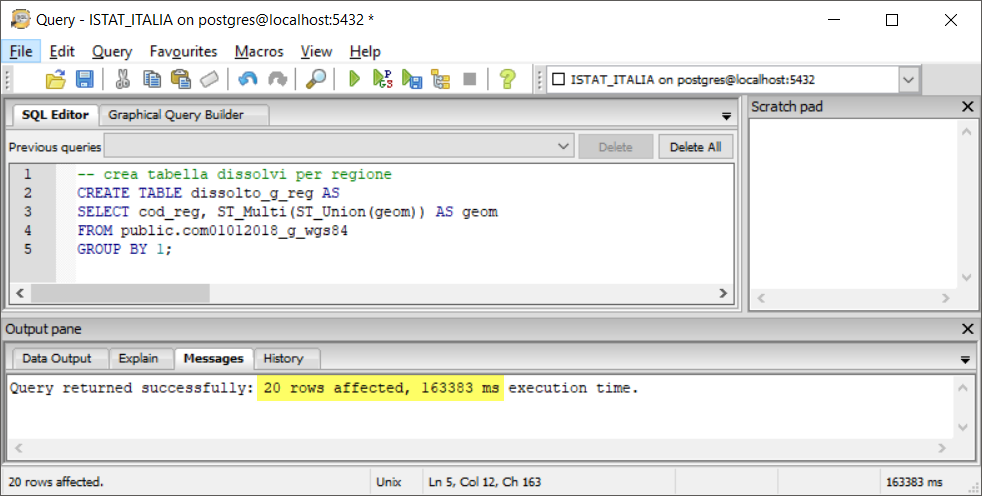

# dissolvi per regione (LZ50)

**dataset:** db sqlite con spatialindex tabella _Com01012018_g_WGS84_

<!-- TOC -->

- [dissolvi per regione (LZ50)](#dissolvi-per-regione-lz50)
    - [QGIS 2.18.24](#qgis-21824)
    - [QGIS 3.2.3](#qgis-323)
    - [QGIS 3.3 master](#qgis-33-master)
    - [SpatiaLite GUI 2.10](#spatialite-gui-210)
    - [PostgreSQL 9.3 / PostGIS 2.2.3 / pgAdmin 3](#postgresql-93--postgis-223--pgadmin-3)
    - [mapshaper](#mapshaper)
    - [R + RStudio](#r--rstudio)
    - [RISULTATI (LZ50) - dissolvi per regione](#risultati-lz50---dissolvi-per-regione)
    - [Osservazioni finali:](#osservazioni-finali)

<!-- /TOC -->

## QGIS 2.18.24


Creando un layer temporaneo in memoria:



Salvando in un file shp:



-->[torna su](#dissolvi-per-regione-lz50)

## QGIS 3.2.3


Creando un layer temporaneo in memoria:



Salvando in un file shp:



-->[torna su](#dissolvi-per-regione-lz50)

## QGIS 3.3 master


NB: Il debug rallenta le prestazioni!!!



Creando un layer temporaneo in memoria:



Salvando in un file shp:


-->[torna su](#dissolvi-per-regione-lz50)

## SpatiaLite GUI 2.10


Creando una tabella:

```
-- crea geotabella dissolvendo per cod_reg
CREATE TABLE dissolve_reg AS
SELECT cod_reg, CastToMultiPolygon(ST_Union(geom)) AS geom
FROM com01012018_G_wgs84
GROUP BY 1;
SELECT RecoverGeometryColumn('dissolve_reg','geom',32632,'MULTIPOLYGON','XY');
-- creo SpatialIndex SpatiaLite
SELECT CreateSpatialIndex ('dissolve_reg','geom');
```


Creando solo una query in memoria:

```
-- crea query in memoria
SELECT cod_reg, CastToMultiPolygon(ST_Union(geom)) AS geom
FROM com01012018_G_wgs84
GROUP BY 1;
```


-->[torna su](#dissolvi-per-regione-lz50)

```
-- Creo query in memoria
SELECT k.gid, k.geom  
FROM ( SELECT (ST_DumpPoints(geom)).*, gid FROM com01012018_wgs84 )k;
```


## PostgreSQL 9.3 / PostGIS 2.2.3 / pgAdmin 3


Creo tabella:

```
-- creo geotabella dissolvi per regione
CREATE TABLE dissolto_g_reg AS
SELECT cod_reg, St_Multi(St_Union(geom)) AS geom
FROM public.com01012018_g_WGS84
GROUP BY 1;
```


Creo query in memoria:

```
-- creo query in memoria
SELECT cod_reg, St_Multi(St_Union(geom)) AS geom
FROM public.com01012018_g_WGS84
GROUP BY 1;
```

-->[torna su](#dissolvi-per-regione-lz50)

## mapshaper


```
time mapshaper encoding=utf-8  Com01012018_g_WGS84.shp -dissolve COD_REG -o dissolto_g_reg_mapsh.shp
```


-->[torna su](#dissolvi-per-regione-lz50)

## R + RStudio


**NB:** restituisce 23.657 punti in meno rispetto tutti gli altri software!!!

```
library("rgdal")
library("maptools")
library("raster")
start.time <- Sys.time()
     ## read shapefile
comuni<-readOGR(dsn = "F:\\Limiti01012018_g\\Com01012018_g", layer = "Com01012018_g_WGS84")
end.time <- Sys.time()
time.taken <- end.time - start.time
time.taken
     ##dissolve with raster
start.time <- Sys.time()
dissolveR<- aggregate(comuni, by ='COD_REG')
#plot(dissolveR)
end.time <- Sys.time()
time.taken <- end.time - start.time
time.taken
    ## writeOGR
start.time <- Sys.time()
writeOGR(dissolveR, dsn = "F:\\Limiti01012018_g\\Com01012018_g",layer="dissolve_regioni_R", driver = "ESRI Shapefile")
end.time <- Sys.time()
time.taken <- end.time - start.time
time.taken
```


## RISULTATI (LZ50) - dissolvi per regione

file/table [sec]|memoria [sec]|software GIS
:---------:|:---------:|---------
126        |  126      |QGIS 2.18.24
99         |   99      |QGIS 3.2.3
99         |   99      |QGIS 3.3 master con debug
98         |   98      |SpatiaLite_GUI 2.10
163        |  155      |pgAdmin 3 con spatialIndex
3.2        |   `-`     |mapshaper
61         |   62      |R + RStudio

`-` prova non possibile! 

[torna su](#dissolvi-per-regione-lz50)

## Osservazioni finali:

In QGIS l'uso dei _file temporanei_ (in memoria) velocizza di parecchio la generazione dell'output di alcuni processing; al contrario in PostGIS, la creazione della tabella è molto più rapida; in RStudio la creazione di un file di output implica sempre più tempo.