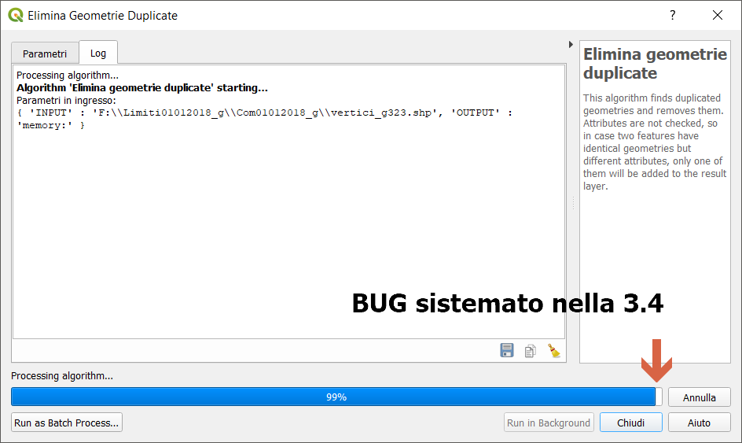
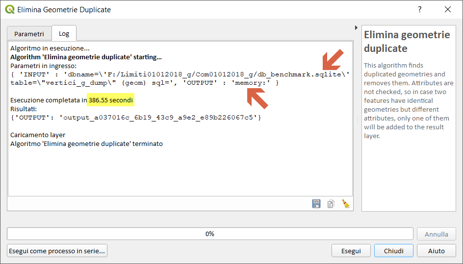
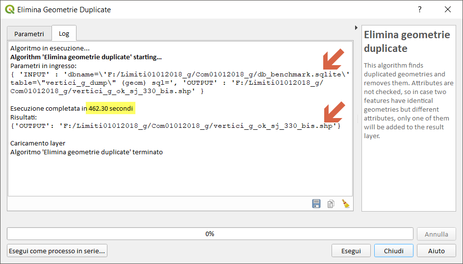
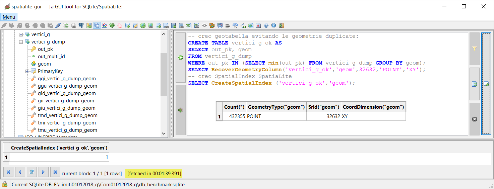
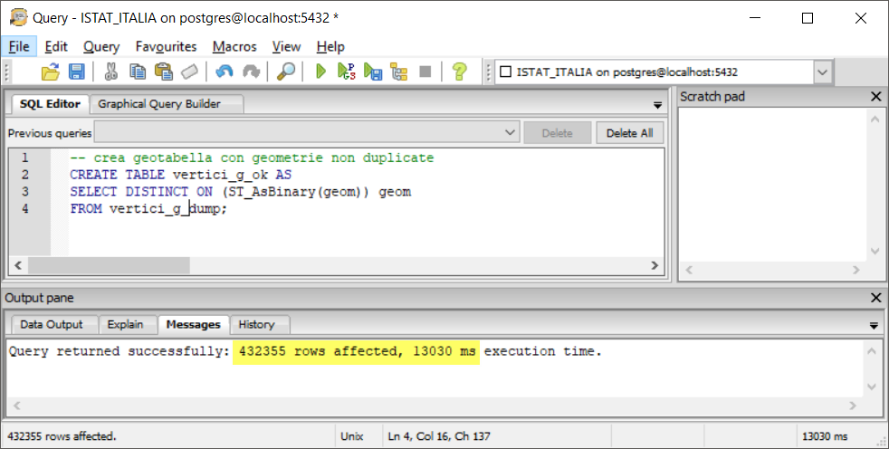
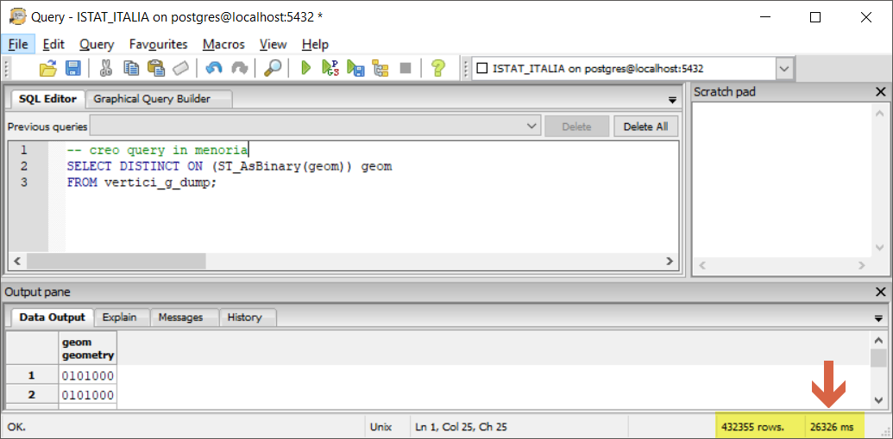

# elimina geometrie duplicate (LZ50)

**dataset:** db sqlite con spatialindex tabella _vertici_g_dump_

<!-- TOC -->

- [elimina geometrie duplicate (LZ50)](#elimina-geometrie-duplicate-lz50)
    - [QGIS 2.18.24](#qgis-21824)
    - [QGIS 3.2.3](#qgis-323)
    - [QGIS 3.3 master](#qgis-33-master)
    - [SpatiaLite GUI 2.10](#spatialite-gui-210)
    - [PostgreSQL 9.3 / PostGIS 2.2.3 / pgAdmin 3](#postgresql-93--postgis-223--pgadmin-3)
    - [mapshaper](#mapshaper)
    - [R + RStudio](#r--rstudio)
    - [RISULTATI (LZ50) - estrai vertici](#risultati-lz50---estrai-vertici)

<!-- /TOC -->

## QGIS 2.18.24


Questo geoalgoritmo è inefficiente e il tempo è troppo lungo, quindi prova non eseguita.

-->[torna su](#estrai-vertici-lz50)

## QGIS 3.2.3


Creando un layer temporaneo in memoria o

Salvando in un file shp:



Questo geoalgoritmo è inefficiente e il tempo è troppo lungo, quindi prova non eseguita. Bug RISOLTO nella prossima verisone 3.4

-->[torna su](#estrai-vertici-lz50)

## QGIS 3.3 master


NB: Il debug rallenta le prestazioni!!!


Creando un layer temporaneo in memoria:



Salvando in un file shp:



-->[torna su](#estrai-vertici-lz50)

## SpatiaLite GUI 2.10


Creo tabella:
```
-- creo geotabella evitando le geometrie duplicate
CREATE TABLE vertici_g_ok AS
SELECT out_pk, geom
FROM vertici_g_dump
WHERE out_pk IN (SELECT min(out_pk) FROM vertici_g_dump GROUP BY geom);
SELECT RecoverGeometryColumn('vertici_g_ok','geom',32632,'POINT','XY');
-- creo SpatialIndex SpatiaLite
SELECT CreateSpatialIndex ('vertici_g_ok','geom');
```


Creo query in memoria:

```
-- creo query in memoria
SELECT out_pk, geom
FROM vertici_g_dump
WHERE out_pk IN (SELECT min(out_pk) FROM vertici_g_dump GROUP BY geom);
```


-->[torna su](#estrai-vertici-lz50)

## PostgreSQL 9.3 / PostGIS 2.2.3 / pgAdmin 3


Creo tabella:

```
-- creo geotabella con geometrie non duplicate
CREATE TABLE vertici_g_ok AS
SELECT DISTINCT ON (ST_AsBinary(geom)) geom 
FROM vertici_g_dump;
```


Creo query in memoria:

```
-- Creo query in memoria
SELECT DISTINCT ON (ST_AsBinary(geom)) geom 
FROM vertici_g_dump;
```



-->[torna su](#estrai-vertici-lz50)

## mapshaper

[issues](https://github.com/mbloch/mapshaper/issues/305) - grazie [Andrea](https://twitter.com/aborruso?lang=it)

Non esiste una funzione che faccia al caso nostro, quello che segue è una forzatura e quindi i tempi sono più lunghi!
```
time node  --max-old-space-size=4192 `which mapshaper` encoding=utf-8 vertici_g.shp -explode -each 'key = this.x + "," + this.y' -uniq key -o vertici_g_ok_mapsh.shp
```


-->[torna su](#estrai-vertici-lz50)

## R + RStudio


```
da fare
```


## RISULTATI (LZ50) - estrai vertici

file/table [sec]|memoria [sec]|software GIS
:---------:|:---------:|---------
  -        |    -      |QGIS 2.18.24
  -        |    -      |QGIS 3.2.3
462        |  387      |QGIS 3.3 master con debug
100        |   19      |SpatiaLite_GUI 2.10
13         |   26      |pgAdmin 3 con spatialIndex
136        |    -      |mapshaper
??         |   ??      |R + RStudio

`-` prova non possibile o bug!  `??` da fare 

[torna su](#estrai-vertici-lz50)