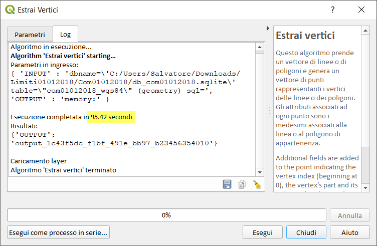
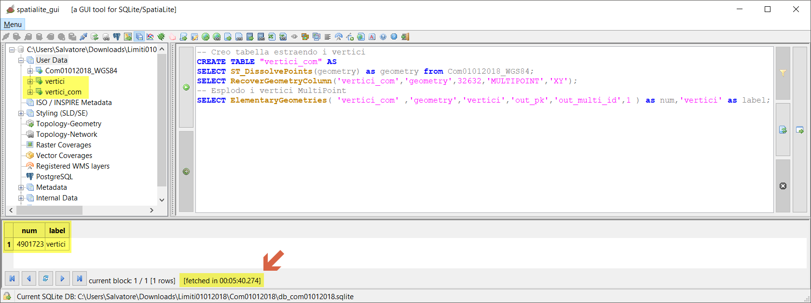
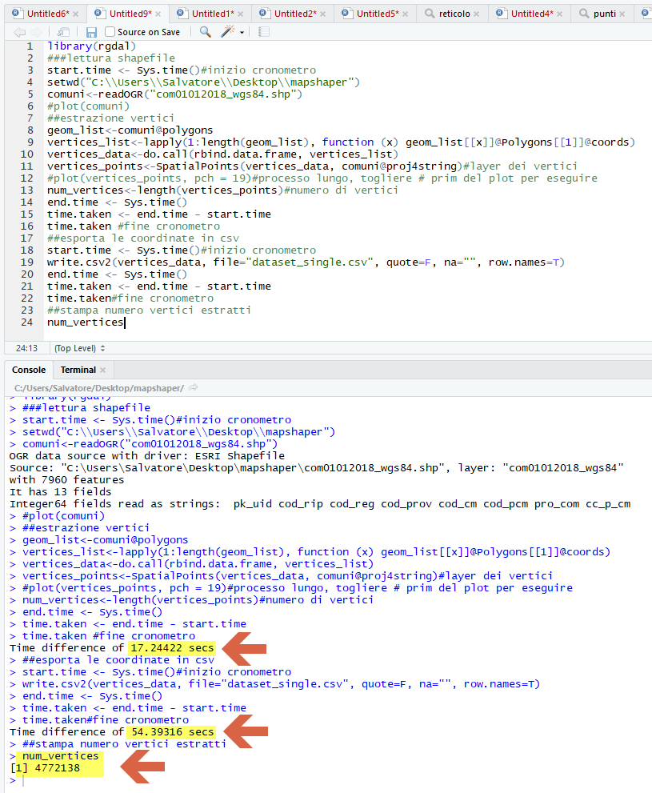

# estrai vertici (LZ50)

dataset: db sqlite con spatialidex

<!-- TOC -->

- [estrai vertici (LZ50)](#estrai-vertici-lz50)
    - [QGIS 2.18.24](#qgis-21824)
    - [QGIS 3.2.3](#qgis-323)
    - [QGIS 3.3 master](#qgis-33-master)
    - [SpatiaLite_GUI 2.10](#spatialitegui-210)
    - [PostgreSQL 9.3 / PostGIS 2.2.3 / pgAdmin 3](#postgresql-93--postgis-223--pgadmin-3)
    - [mapshaper](#mapshaper)
    - [R + RStudio](#r--rstudio)
    - [RISULTATI (LZ50) - estrai vertici](#risultati-lz50---estrai-vertici)
    - [RISULTATI (xxx) - estrai vertici](#risultati-xxx---estrai-vertici)

<!-- /TOC -->

## QGIS 2.18.24


## QGIS 3.2.3


## QGIS 3.3 master


NB: Il debug rallenta le prestazioni!!!




## SpatiaLite_GUI 2.10

estraggo i vertici:


```
-- Creo tabella estraendo i vertici
CREATE TABLE "vertici_com" AS
SELECT ST_DissolvePoints(geometry) as geometry from Com01012018_WGS84;
SELECT RecoverGeometryColumn('vertici_com','geometry',32632,'MULTIPOINT','XY');
-- Esplodo i vertici MultiPoint
SELECT ElementaryGeometries( 'vertici_com' ,'geometry' , 'vertici' ,'out_pk' , 'out_multi_id', 1 ) as num, 'vertici' as label;
```


## PostgreSQL 9.3 / PostGIS 2.2.3 / pgAdmin 3


```
-- crea tabella vertici_dump
CREATE TABLE vertici_dump AS
SELECT k.gid, k.geom  
FROM ( SELECT (ST_DumpPoints(geom)).*, gid FROM com01012018_wgs84 )k;
```


## mapshaper

```
time node  --max-old-space-size=4192 `which mapshaper` encoding=utf-8 com01012018_wgs84.shp -points vertices -explode -o vertici_com01012018_wgs84.shp
```

NB: restituisce circa 9000 punti in meno!!! (non capisco il perché)


## R + RStudio

Osservazioni: restituisce un numero di punti minori ed esporto in csv!!!

```
library(rgdal)
###lettura shapefile
start.time <- Sys.time()#inizio cronometro
setwd("C:\\Users\\Salvatore\\Desktop\\mapshaper")
comuni<-readOGR("com01012018_wgs84.shp")
#plot(comuni)
##estrazione vertici
geom_list<-comuni@polygons
vertices_list<-lapply(1:length(geom_list), function (x) geom_list[[x]]@Polygons[[1]]@coords)
vertices_data<-do.call(rbind.data.frame, vertices_list)
vertices_points<-SpatialPoints(vertices_data, comuni@proj4string)#layer dei vertici
#plot(vertices_points, pch = 19)#processo lungo, togliere # prim del plot per eseguire
num_vertices<-length(vertices_points)#numero di vertici
end.time <- Sys.time()
time.taken <- end.time - start.time
time.taken #fine cronometro
##esporta le coordinate in csv
start.time <- Sys.time()#inizio cronometro
write.csv2(vertices_data, file="dataset_single.csv", quote=F, na="", row.names=T)
end.time <- Sys.time()
time.taken <- end.time - start.time
time.taken#fine cronometro
##stampa numero vertici estratti
num_vertices
```


## RISULTATI (LZ50) - estrai vertici

tempo [sec]|programma
:---------:|---------
123|QGIS 2.18.24
66|QGIS 3.2.3
95|QGIS 3.3 master con debug
340|SpatiaLite_GUI 2.10
21|pgAdmin 3 con spatialIndex
380|mapshaper
17+54|R + RStudio

## RISULTATI (xxx) - estrai vertici

tempo [sec]|programma
:---------:|---------
sss|QGIS 2.18.24
sss|QGIS 3.2.3
sss|QGIS 3.3 master con debug
sss|SpatiaLite_GUI 2.10
sss|pgAdmin 3 con spatialIndex
sss|mapshaper
sss|R + RStudio