# spatial join - attibuti per posizione (LZ50)

**dataset:** db sqlite con spatialindex tabella _vertici_g_ok_ e _buffer_2km_g_

<!-- TOC -->

- [spatial join - attibuti per posizione (LZ50)](#spatial-join---attibuti-per-posizione-lz50)
    - [QGIS 2.18.24](#qgis-21824)
    - [QGIS 3.2.3](#qgis-323)
    - [QGIS 3.3 master](#qgis-33-master)
    - [SpatiaLite GUI 2.10](#spatialite-gui-210)
    - [PostgreSQL 9.3 / PostGIS 2.2.3 / pgAdmin 3](#postgresql-93--postgis-223--pgadmin-3)
    - [mapshaper](#mapshaper)
    - [R + RStudio](#r--rstudio)
    - [RISULTATI (LZ50) - spatial join - attibuti per posizione](#risultati-lz50---spatial-join---attibuti-per-posizione)
    - [Osservazioni finali:](#osservazioni-finali)

<!-- /TOC -->

## QGIS 2.18.24


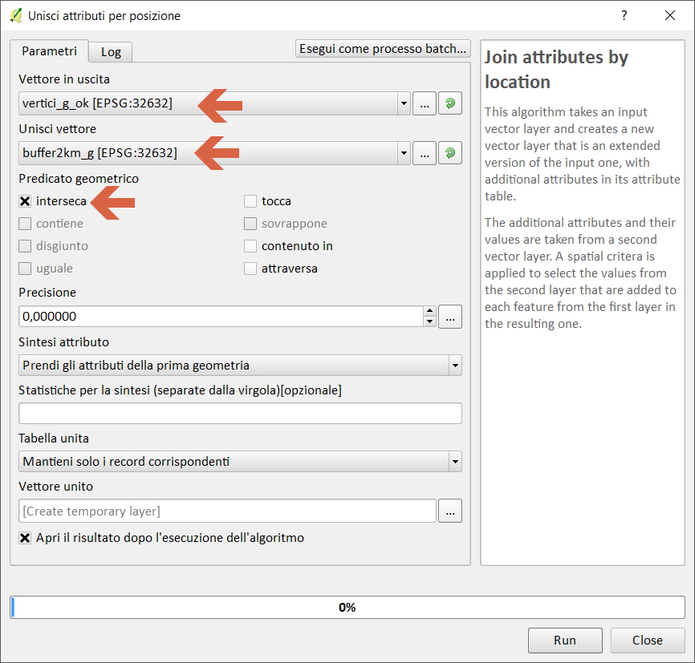

Creando un layer temporaneo in memoria:

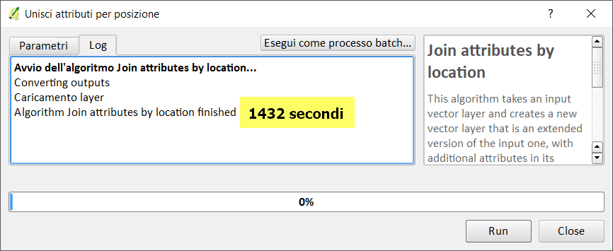


-->[torna su](#spatial-join---attibuti-per-posizione-lz50)

## QGIS 3.2.3


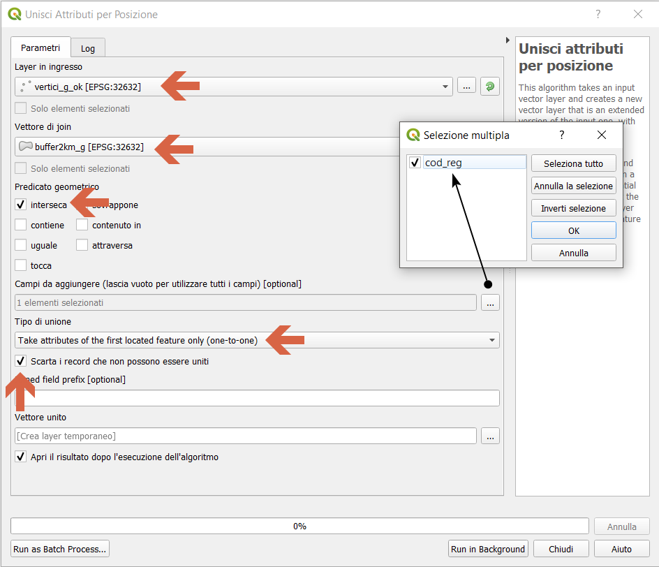

Creando un layer temporaneo in memoria:

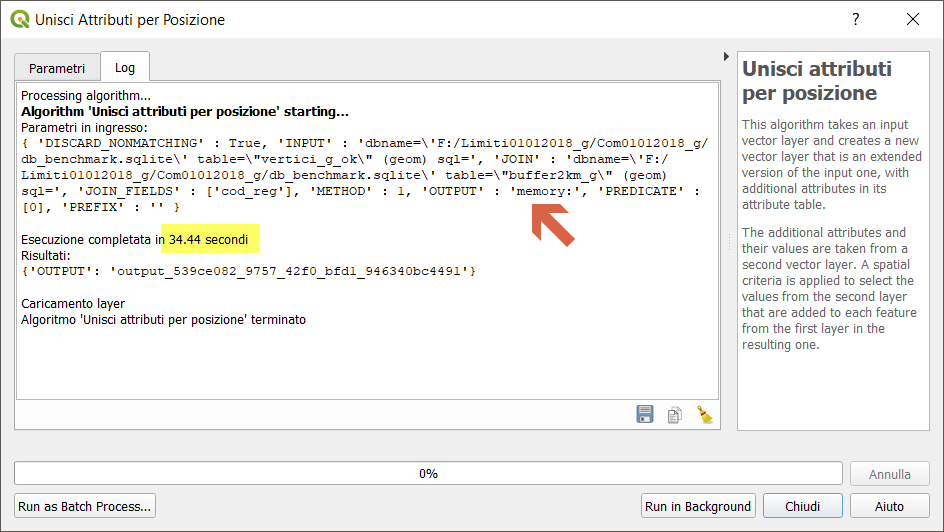

Salvando in un file shp:


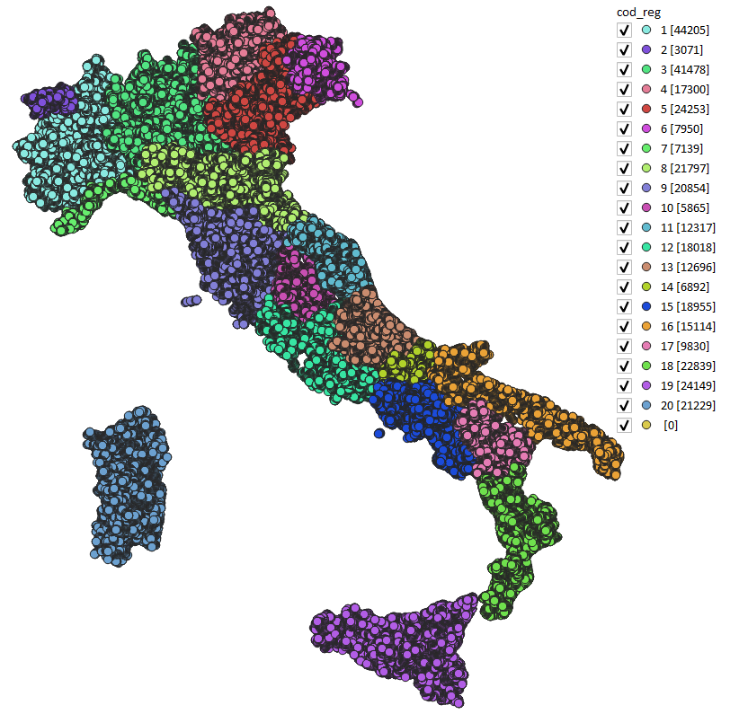

-->[torna su](#spatial-join---attibuti-per-posizione-lz50)

## QGIS 3.3 master


NB: Il debug rallenta le prestazioni!!!

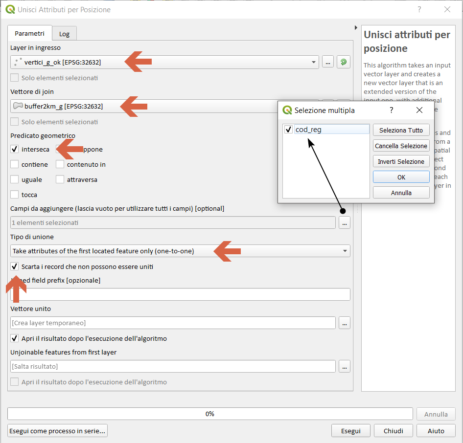

Creando un layer temporaneo in memoria:

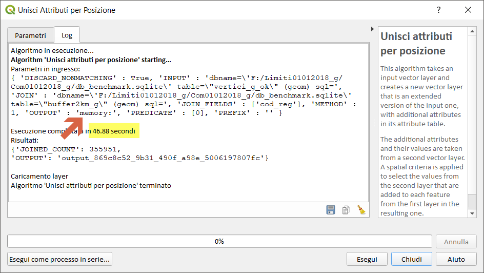

Salvando in un file shp:

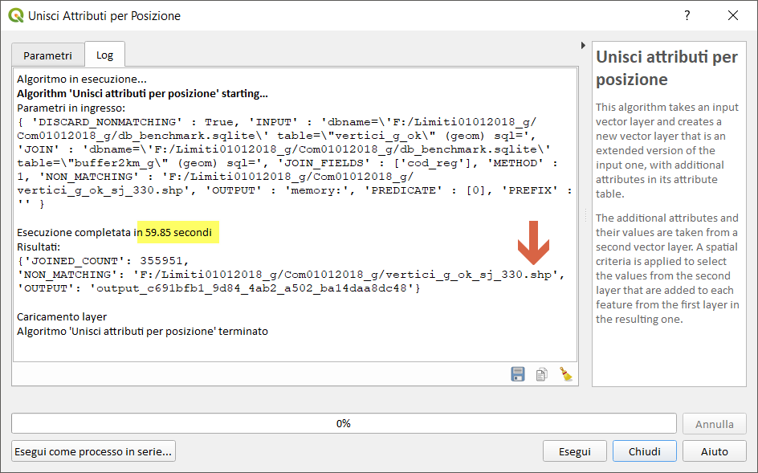

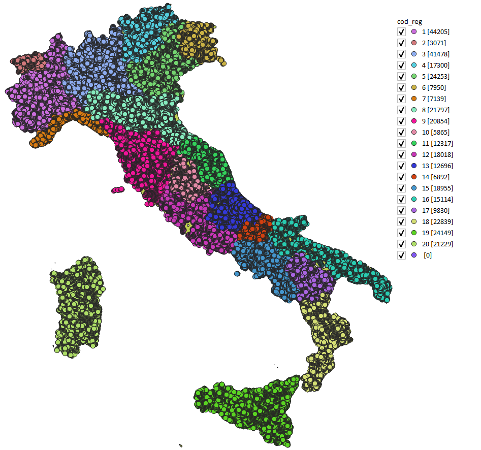

-->[torna su](#spatial-join---attibuti-per-posizione-lz50)

## SpatiaLite GUI 2.10


Creando una tabella:

```
-- creo geotabella vertici_g_ok2_sj per spatial join - trasferire 'cod_reg'
CREATE TABLE "vertici_g_ok2_sj" AS
SELECT b.cod_reg AS cod_reg, v.geom AS geom
FROM "buffer2km_g" b JOIN "vertici_g_ok2" v ON St_Intersects (b.geom, v.geom)
WHERE v.out_pk IN (
SELECT rowid FROM SpatialIndex WHERE f_table_name = 'vertici_g_ok2'
AND search_frame = b.geom);
SELECT RecoverGeometryColumn('vertici_g_ok2_sj','geom',32632,'POINT','XY');
```
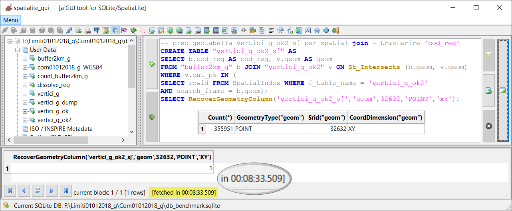

Creando una query in memoria:

```
-- creo query in memoria
SELECT b.cod_reg AS cod_reg, v.geom AS geom
FROM "buffer2km_g" b JOIN "vertici_g_ok2" v ON St_Intersects (b.geom, v.geom)
WHERE v.out_pk IN (
SELECT rowid FROM SpatialIndex WHERE f_table_name = 'vertici_g_ok2'
AND search_frame = b.geom);
```

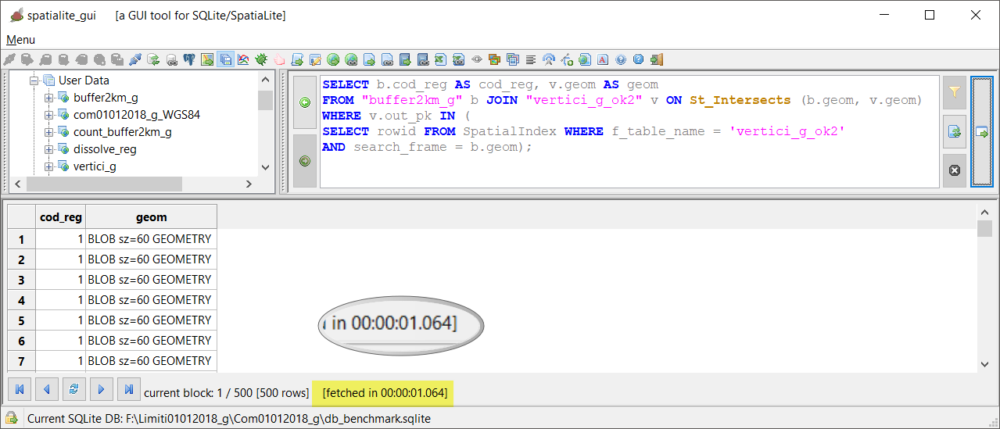

-->[torna su](#spatial-join---attibuti-per-posizione-lz50)

## PostgreSQL 9.3 / PostGIS 2.2.3 / pgAdmin 3


Creo tabella:

```
-- creo geotabella vertici_g_ok_sj per spatial join
CREATE TABLE vertici_g_ok_sj AS
SELECT b.cod_reg, v.geom AS geom
FROM buffer2km_g b join vertici_g_ok v on st_intersects(b.geom,v.geom);
```
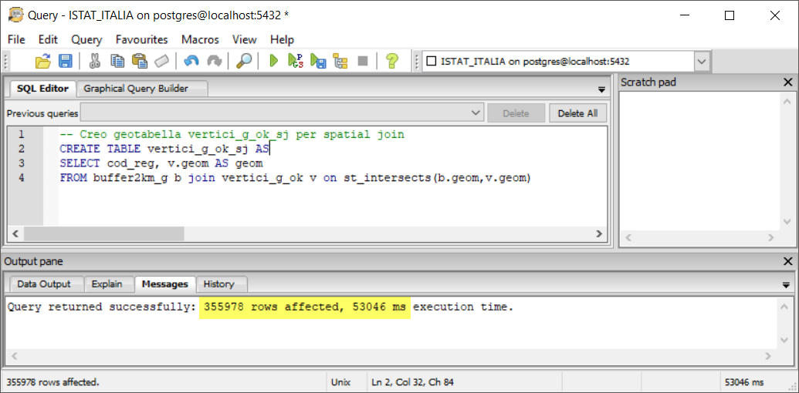

Creo query in memoria:

```
-- creo query in memoria
SELECT b.cod_reg, v.geom AS geom
FROM buffer2km_g b join vertici_g_ok v on st_intersects(b.geom,v.geom);
```


-->[torna su](#spatial-join---attibuti-per-posizione-lz50)

## mapshaper


```
time node  --max-old-space-size=4192 `which mapshaper` encoding=utf-8 vertici_g_ok_330.shp -join dissolto_g_reg_330.shp calc= fields=cod_reg -o vertici_g_ok_sjoin.shp
```

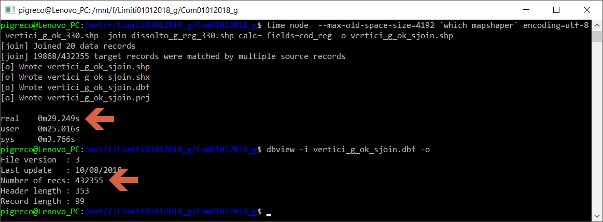


-->[torna su](#spatial-join---attibuti-per-posizione-lz50)

## R + RStudio


```
da fare!!!
```


## RISULTATI (LZ50) - spatial join - attibuti per posizione

file/table [sec]|memoria [sec]|software GIS
:---------:|:---------:|---------
+1432      |   1432    |QGIS 2.18.24
57         |   34      |QGIS 3.2.3
60         |   47      |QGIS 3.3 master con debug
513        |     1     |SpatiaLite_GUI 2.10
530        |   26      |pgAdmin 3 con spatialIndex
29         |   `-`     |mapshaper
???        |   ???     |R + RStudio

`-` prova non possibile! ??? da fare

[torna su](#spatial-join---attibuti-per-posizione-lz50)

## Osservazioni finali:

In QGIS l'uso dei _file temporanei_ (in memoria) velocizza di parecchio la generazione dell'output di alcuni processing.